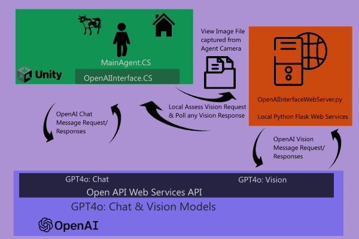
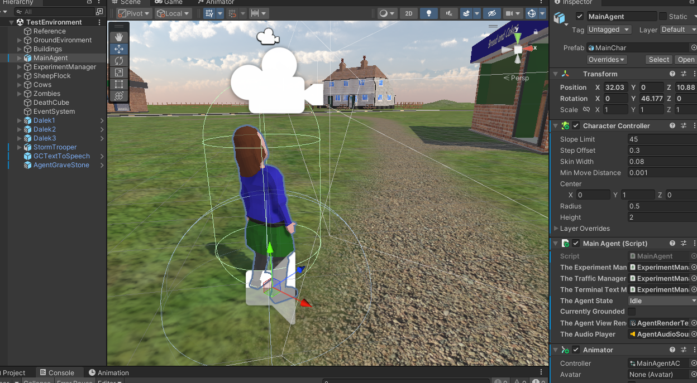

# Lucy In The Sky With OPENAi Services
A rough Experiment into using OpenAI Vision and Chat API Services from a low poly Unity Game Environment. It uses OpenAI GPT4o Chat and Vision API services from a Game Agent within Unity environment.

## Video Demonstration ##
Please see the [brief You Tube Video demonstration here](https://www.youtube.com/watch?v=rAbuMg2NdRY)  

## Implementation Details ##
This experiment is based upon a combination of a Unity Game Environment, calling out into Open AI GPT4o Web API Services.  An interim python Web Server is utilised to broker GPT4O vsion requests.   

I have also used the Google Text to Speech API service to animate the Agnet voices, to animate the returned OpenAI Chat textual conversations. 

### Unity Scene  ###
I have used the Unity game engine, as basis for setting up a character within a scene.  Unity is well understood and quick framework for creating game scenes and for simulating agents operating in a synthetic environment. It utilises .NET C# runtime as its main scripting language.  

Note the Agent is Manually controlled, with user initiated requests for a vision capture and awareness. There is no automated Agent control (yet) in this simulation.  

The main Unity script files are:
- ExperimentManager.CS      :  This is the overall Experiment coordination. It manages the responses from the User Interface, into the Agent
- MainAgent.CS         :  This Script controls the Agent within the Environment. It coordinates the user requested Agent movements, and situational awareness Agent requests. 
- OpenAIInterface.CS     :  This provides a wrapper around the calls to the OpenAI services. It makes direct calls to OpenAI GPT4o Chat, but Indirect Vision requests via local Web Interface. ( Note many of these methods have to be implemented as async, to avoid the slow web services reponses halting the main Agent response thread. )   
- TerminalManager.CS   :  This manages a Terminal like Usr Interface.

### Unity Package Limitations ###
Note I have provided a most of the Unity Enviornment here, as a Unity Package.  However some of the third party assets are missing due to limited upload size and lisence rights: 
- Zombie Models (Note these are a free download from Mizamo)      
- FrostByte Text To Speech Services (Paid Asset in Unity Asset Store)  
- Jodrell Bank and the StormTrooper models
- SkyBox Materials and Textures (Free Asset from Unity Asset Store) 
- A few Materials Textures, as too large to export  

###  Open AI Services and Use of a Local Python Web Server ##

The C# OKGoDoIt package provides a C# interface with OpenAI services. See refernce to the GitHub based project below. Although this packae is getting a little out of date. It still provides a foundation for basic Chat based interactions with OpenAI Chat services. The OpenAIInterface.CS uses this package for the direct chat interactions with Open AI. 

However for the image based uploads and interaction, I had difficulty in getting this C# based interface to work. So being impatient, I reverted to a python interaction with Open AI for the GPT4o vision API. There is a lot quicker and more reponsive support in python OpenAI packages. The image based interactions with OpenAI are via a local python flask web server.  

The Agent's first person View, is rendered from the Agents front facing camera into a Rendered Texture within Unity. Upon a request to perform a View Assessment, this rendered texture is written out to a local file.  See the TakeFrontPicture() method within MainAgent.CS.  This file is then passed up into OpenAI GPT:40 vision service, via the Flask based  OpenAIInterfaceWebServer.py, which reads the files, processes it into bytes suitable for the OpenAi GPT4o vision API web service call.  

I had to utilise a python interface to the OpenAI vision service. Please see the basic Flask based python Web Server within the OpenAIInterfaceWebServer.py.   
In addition to a python based call, this web interface, enables the long Open AI web query response, lage times to be thread decoupled from the running of the Unity Game Environment. 

This local web server provides two http POST based endpoints:
- requestview:        This Service method reads the local Image File, and uploads to OpenAI: GPT4o Web service API, requesting a basic description of whats in the view image
- QueryPictureRequest: This Service method checks if there has been any response from the Image query and returns the OpenAI response description if available   

You will need a python environment with OpenAI and Flask packages installed. Thsi local web server can be run simply as python OpenAIInterfaceWebServer.py

Note C# OKGoDoIt wrapper services for OpenAI, is  awaiting a major revamp very soon (June 2024), where it will become more consistent with supporting the latest OpenAI services.  This will hopefully soon provide opportunity to avoid deferring the file upload to a pyhton based service. 

## Observations and Discussion ##

The Architecture and GPT4o OPEN AI Services offer a reasonable level of recognition and understanding of the game environment scene.

It is a rather stilted experience.  The Web based OpenAI Reques/Responses take several seconds and so it is not a real time responsive experience. OpenAI Vsion is only accepting still images, and not live real time video. And so there is a latency and delay from what was viwed previously.  Note we can expect video assessments and live stream services in the future.

The OpenAI vision can currently only describe main objects and features within the View presented to it. It cannot appreciate the spatial view, left, right, behind, in relation to the Agent in the 3D environment.  So there is no real spatial awareness connection. 

There is rather limited contextual retention from previous view snapshots and what the Agent has done previously. This was constrained as  I had to seperate the Chat Intercations from the Vision requests. So there is some discontinuity between the vision and the conversational contextes. 

We could expect better recognition performance in a higher fidelity game environment. (e.g. the use of High Fidelity Assets and scenes within the Unreal game engine) 

## Further Work and Development ##

To understand how to issue a Command Syntax within the OpenAI Chat responees, so to get the Chat reponses to instruct the Agent movements and actions, and hence more autonmous operation. 

Review performance in a higher fidelity game environment. (Perhaps replicate in Unreal, with high quality game assets) 

## Acknowledgements ##

- [Open AI GPT API Service](https://platform.openai.com/docs/api-reference/introduction)
- [OKGoDolt A C# Wrapper for OPEN AI Calls](https://github.com/OkGoDoIt/OpenAI-API-dotnet)
- [FrostWeep Games: Google Text to Speech Wrapper Asset]( https://assetstore.unity.com/packages/add-ons/machinelearning/text-to-speech-using-google-cloud-pro-115170#description)

And watch any Connor Leahy in conversation. He is  awesome in awareness and explanation. 
https://www.youtube.com/watch?v=YZjmZFDx-pA

